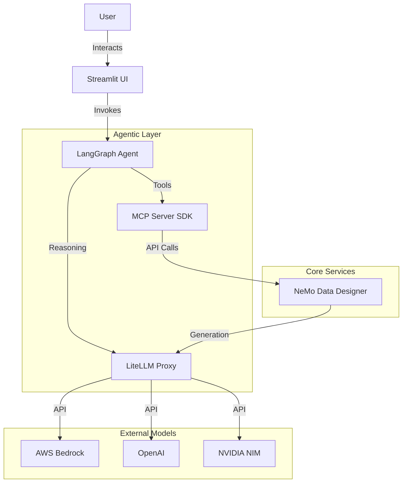

# System Architecture

This system allows an autonomous AI agent to design and generate synthetic datasets by interacting with the NVIDIA NeMo Data Designer microservice.

## High-Level Overview

## Component Details

### 1. LangGraph Agent (`/langgraph`)
An event-driven autonomous agent built with LangGraph.
- **Role:** acts as the "Data Scientist". It takes user requirements (e.g., "I need a dataset of fake medical invoices"), reasons about the schema, and calls the appropriate tools to define columns and constraints.
- **Key Logic:**
    - `reasoner_node`: Decides next steps using an LLM.
    - `tool_executor_node`: Executes MCP tools.
    - `submitter_node`: Finalizes the job submission.

### 2. MCP Server SDK (`/mcp_server_py`)
A wrapper around the NeMo Data Designer SDK, exposing its capabilities via the Model Context Protocol (MCP).
- **Role:** The "Bridge". It defines tools like `add_llm_text_column`, `add_gaussian_column`, `create_job` that the agent can understand and call.
- **Technology:** `fastmcp`, `nemo_microservices` SDK.

### 3. NeMo Data Designer
Official NVIDIA microservice for synthetic data generation.
- **Role:** The "Engine". It handles the heavy lifting of sampling distributions, enforcing constraints, and querying LLMs to generate text content for columns.
- **Deployment:** Deployed via Docker Compose (local) or Helm/GitOps (K8s).

### 4. LiteLLM (`/litellm-langchain`)
An OpenAI-compatible gateway that manages access to various LLM providers.
- **Role:** "Unified Interface". It allows the Agent and NeMo to talk to Bedrock (Claude), Azure, or OpenAI using a single API format.
- **Features:** Logging, cost tracking, key management.

### 5. Streamlit UI (`/streamlit_app`)
A frontend application.
- **Role:** "Dashboard". Allows users to chat with the agent, view generation progress, and preview/download the resulting datasets.

## Infrastructure

The system is designed for **GitOps** deployment on AWS EKS.
- **Terraform:** Provision EKS cluster, ECR repositories, and IAM roles.
- **FluxCD:** Synchronizes the K8s cluster state with the `nemo-gitops` directory in this repository.
- **Secrets:** Managed via Kubernetes Secrets (mapped to Env Vars).
